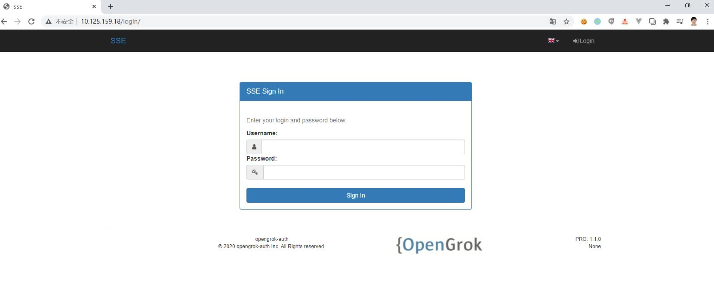
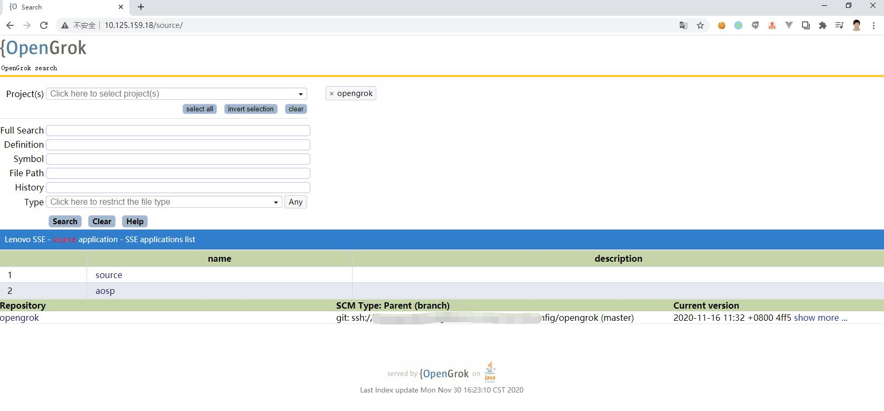
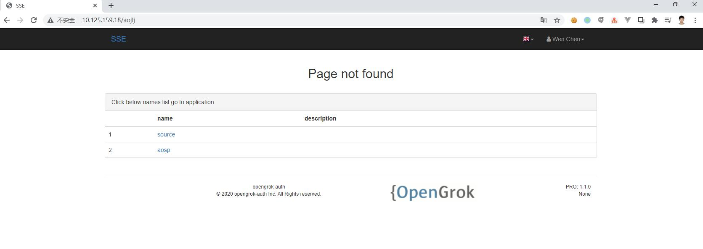
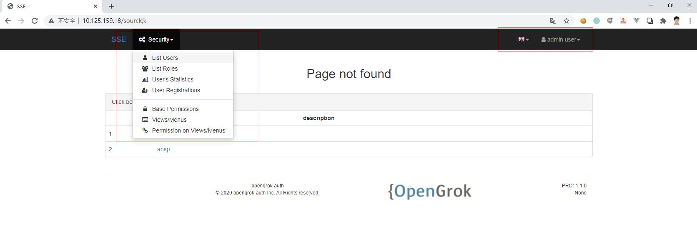

# Opengrok-auth

 An opengrok dockerization app with remote auth app init.

 ## Release note
  - v1.0.0 opengrok-auth with Flask app authentication


Opengrok-auth
==========
> Opengrok-auth use Flask app as the inner authentication/authorization app to do the opengrok auth.


> [Guide doc](https://cw1427.github.io/opengrok-auth/)

 What is it:
 -----------

We integrated with those technical and refer

> UI a glance

 ## Opengrok auth login page

 ## After successfully login(LDAP or local user/pwd) jump to opnegrok app

 ## App not found would goes to opengrok-auth app 404 page

 ## Use built-in admin account login can goes to auth menu to add local account.



# Quick start

> bring up apps with docker

## 1. docker env

`linux
$ curl -fsSL https://get.docker.com -o get-docker.sh
$ sudo sh get-docker.sh
`

## 2. pyenv with python3.7 and docker-compose
`linux
 curl -L https://github.com/pyenv/pyenv-installer/raw/master/bin/pyenv-installer | bash
 pip install docker-compose==1.22.0
`

## 3. use docker-compose-product-allin.yml
`
docker-compose -f docker-compose-product-allin.yml up -d
`

```linux
version: '3'
services:
  sse:
    image: cw1427/opengrok-auth:1.0.0
    container_name: sse
    network_mode: host
    depends_on:
     - sseauthapp
    ports:
     - 8080:8080
    volumes:
     - ./webapps:/usr/local/tomcat/webapps
     - ./logs:/usr/local/tomcat/logs
     - ./src:/opengrok/src
     - ./data:/opengrok/data
     - ./etc:/opengrok/etc
     - /etc/localtime:/etc/localtime:ro
     - /etc/timezone:/etc/timezone:ro
    environment:
     - GOSU_USER=0:0
    restart: always
    ulimits:
      nproc: 65535
      nofile:
        soft: 32000
        hard: 40000
        
  sseauthapp:
    image:  cw1427/opengrok-authapp:1.1.0
    container_name: sseauthapp
    network_mode: host
    ports:
     - 8082:8082
    volumes:
     - ./logs:/authapp/logs
     - ./flask_session:/authapp/flask_session
     - ./app.db:/authapp/app.db
     - /etc/localtime:/etc/localtime:ro
     - /etc/timezone:/etc/timezone:ro
    environment:
     - CONFIG_ENV=config_product.py
     - AUTH_LDAP_SERVER="ldap://your.company.com:389/"
     - AUTH_LDAP_SEARCH="ou=people,ou=intranet,dc=****,dc=com"
     - AUTH_LDAP_UID_FIELD=GUID
    restart: always
    ulimits:
      nproc: 65535
      nofile:
        soft: 32000
        hard: 40000
```

## 4. copy the app.db file from github  cw1427/opengrok-auth to your local

app.db is the sqlite3 db file with default  admin/Aa123456 admin account built-in. If you don't want to use it,
you can ignore this step. And after the docker images bring up, use "docker exec -it sseauthapp /bin/sh" login
container, and use "fabmanager" command to create your initialized admin account.

```linux
docker-compose -f docker-compose-product-allin.yml up -d

```

## 5. Nginx config

> We use Nginx 'auth_request' director to proxy the auth through authapp in 8082 port.

after successfully bring up docker container, we have to setup Nginx,
just replace the <your server name> as your real server address
```linux

upstream opengrok {
 server 127.0.0.1:8080 fail_timeout=0;
}

server {
  # Change this if you want to serve your application on another port
  listen 88;

  # Replace this with your domain name
  server_name <your server name>;
  
  # add remote auth location
  location = /auth {
       internal;
       proxy_pass   http://127.0.0.1:8082/api/remotelogin;
       proxy_pass_request_body     off;
       proxy_set_header Content-Length "";
       proxy_set_header X-Original-URI $request_uri;
       proxy_set_header Host $http_host;
       proxy_set_header X-Real-IP $remote_addr;
       proxy_set_header X-Forwarded-For $proxy_add_x_forwarded_for;
       proxy_set_header X-Forwarded-Proto $scheme;
  }

  rewrite ^/$ /source/ redirect;
  location /source/ {
    #use nginx auth_request
    auth_request     /auth;
    auth_request_set $auth_status $upstream_status;
    error_page 401 = @error401;
   
    proxy_set_header X-Forwarded-Host $host;
    proxy_set_header X-Real-IP $remote_addr;
    proxy_set_header X-Forwarded-Server $host;
    proxy_set_header X-Forwarded-For $proxy_add_x_forwarded_for;
    if ( $request_uri ~ ^/source/(.*)$ ) {
        proxy_pass http://opengrok/source/$1;
    }
    proxy_pass http://opengrok/source/;
    proxy_read_timeout 90;
    proxy_http_version 1.1;
    proxy_request_buffering off;

  }

  location @error401 {
   return 302 /login;
  }
  
  location /login {
    #use nginx auth_request
    add_header Set-Cookie "remote_login=$scheme://$http_host$request_uri;Domain=<your server name>;Path=/";
    proxy_pass http://127.0.0.1:8082/login;
  
  }

  location / {
    try_files $uri $uri/ @authsite;
    expires max;
    access_log off;
  }
  
  location @authsite {
    proxy_set_header X-Real-IP  $remote_addr;
    proxy_set_header Host $host:$server_port;
    proxy_set_header X-Forwarded-For $proxy_add_x_forwarded_for;
    proxy_pass http://127.0.0.1:8082;
    proxy_set_header X-Forwarded-Host $host;
    proxy_set_header X-Real-IP $remote_addr;
    proxy_set_header X-Forwarded-Server $host;
  }

}

```

Features
--------
 - Opengrok
 - Dockerization
 - Flask app
 - LDAP
 - Local authentication

Depends on:
-----------

- Opengrok
- Docker
- Flask

# Deployment and Open source:

## Deployed it into npmjs:

## Deploy and install:
 - TODO

- docsify

 Running up dosify by command
```linux
$ docsify serve ./docs/
```
